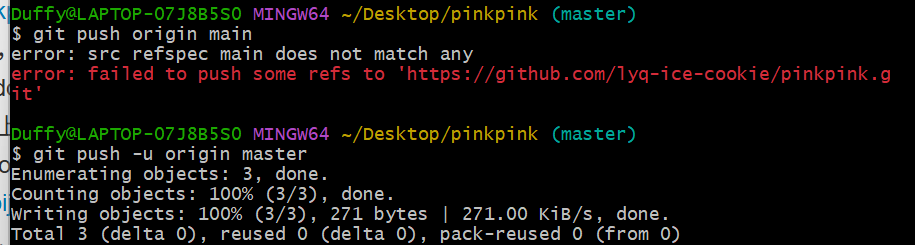
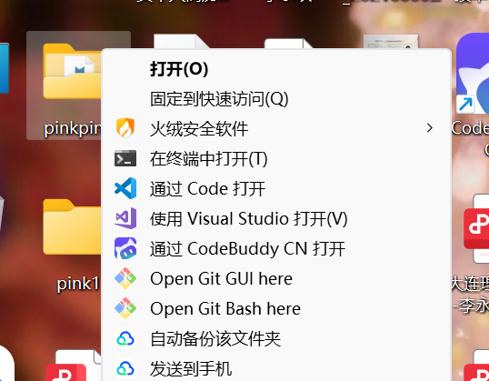
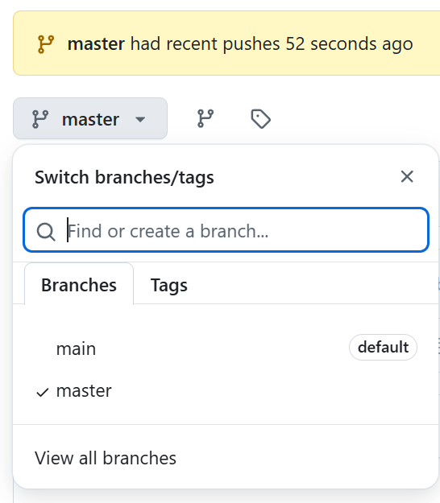

# pinkpink

测试1
git add README.md        # 将新文件添加到暂存区
git commit -m "添加新的 README.md 文件"  # 提交更改
git push origin main     # 推送到远程仓库

说明
git add .                # 1. 把修改/新增的文件“暂存”
git commit -m "说明"     # 2. 提交到本地仓库（"说明"换成你这次改了什么）
git push origin main     # 3. 推到你 GitHub 的 main 分支

**git add . 是一次性打包当前目录所有变更，而 git add 具体文件名 则是精确挑选单个文件**。

**创建文件**`New-Item yq1.md -ItemType File`

**链接记录：**
我的仓库https://github.com/lyq-ice-cookie/yqtest.git

**总结**https://blog.csdn.net/Bin_niB/article/details/135915738?ops_request_misc=&request_id=&biz_id=102&utm_term=vscode%E5%92%8Cgithub%E7%9A%84%E8%BF%9E%E6%8E%A5&utm_medium=distribute.pc_search_result.none-task-blog-2~all~sobaiduweb~default-4-135915738.142^v102^pc_search_result_base2&spm=1018.2226.3001.4187

**通过ssh连接github**
https://blog.csdn.net/Bin_niB/article/details/135915738?ops_request_misc=&request_id=&biz_id=102&utm_term=vscode%E5%92%8Cgithub%E7%9A%84%E8%BF%9E%E6%8E%A5&utm_medium=distribute.pc_search_result.none-task-blog-2~all~sobaiduweb~default-4-135915738.142^v102^pc_search_result_base2&spm=1018.2226.3001.4187
**密钥文件路径**"C:\Users\Duffy\.ssh\id_rsa.pub"

**复杂版没看完**https://blog.csdn.net/Hong_J_0826/article/details/141098022?ops_request_misc=&request_id=&biz_id=102&utm_term=vscode%E5%92%8Cgithub%E7%9A%84%E8%BF%9E%E6%8E%A5&utm_medium=distribute.pc_search_result.none-task-blog-2~all~sobaiduweb~default-0-141098022.142^v102^pc_search_result_base2&spm=1018.2226.3001.4187

