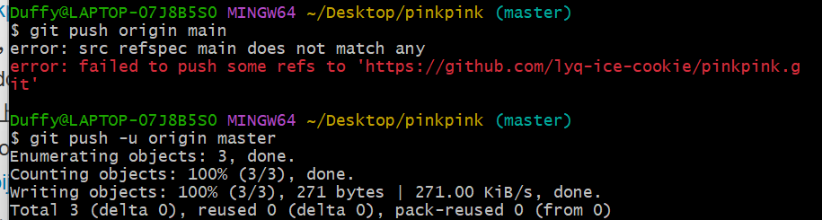
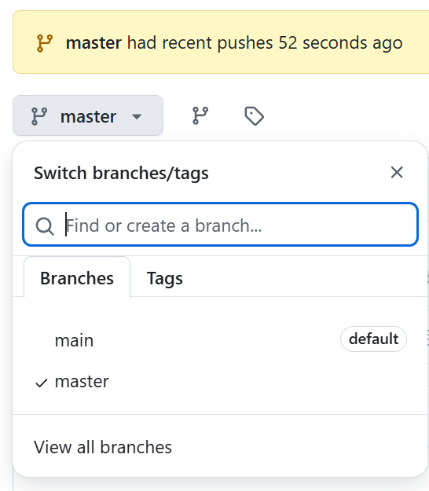
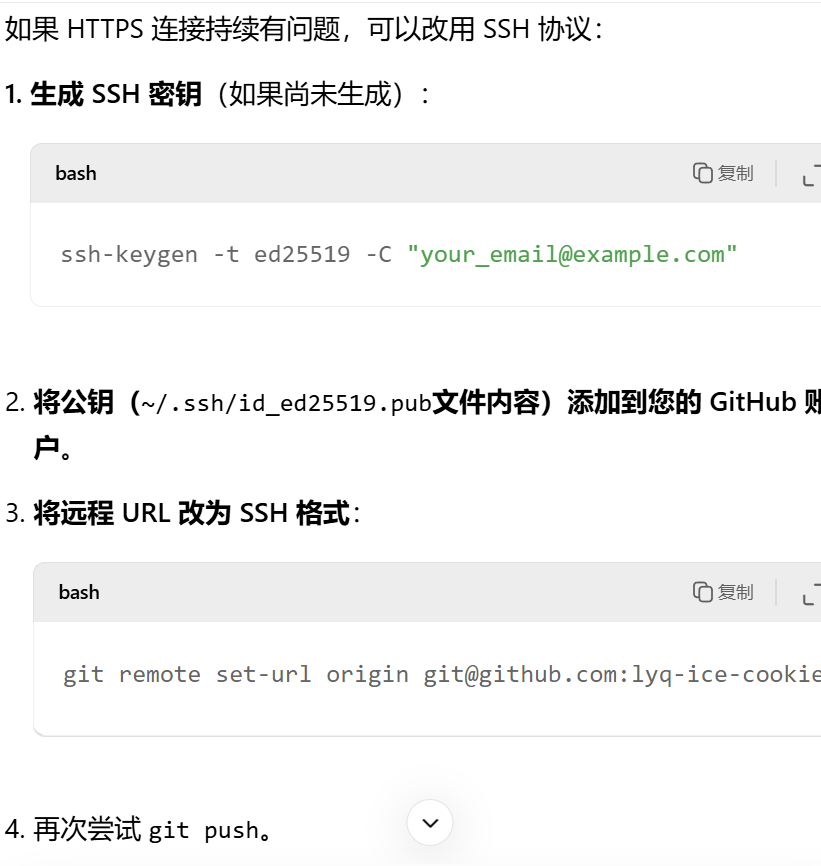

3/14
流程：
1.右键文件夹最外面那个pinkpink，打开右键gitbashhere
2.开始输入
 （1）git init//初始化应该都要加
 （2）git remote add origin https://github.com/lyq-ice-cookie/pinkpink.git
//前面不变，后面HTTP后要变，自己的仓库链接
（3）git add READMEbiji.md
//暂存想要上传的
（4） git commit -m "3月14日，添加新的 READMEbiji.md 文件"
//引号里变，输入文字说明更改了什么东西
（5）git push origin main
git push -u origin master
//注意两种写法。第一是main分支，第二是master（看前面括号有master）

github上也是两个分支

之后传送都需要暂存，说明，推送三个步骤

如果传送失败：
